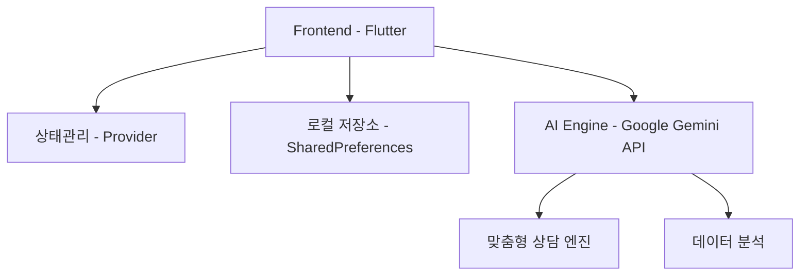

<div align="center">

# 🚭 NoSmoke
### AI 기반 스마트 금연 도우미

[](https://flutter.dev)
[](https://deepmind.google/technologies/gemini/)
[](https://pub.dev/packages/provider)
[](https://github.com/Mseunghwan/no_smoke/stargazers)
[](https://opensource.org/licenses/MIT)

<p align="center"> 
   
  <br> 
  <em>당신의 새로운 시작을 함께할 스마트한 금연 파트너</em>
</p> 

</div>

## 📌 목차
- [소개](#-소개)
- [주요 기능](#-주요-기능)
- [기술 스택](#-기술-스택)
- [시작하기](#-시작하기)
- [프로젝트 구조](#-프로젝트-구조)
- [기여하기](#-기여하기)
- [라이센스](#-라이센스)

## 🌟 소개
**NoSmoke**는 과학적 접근방식과 AI 기술을 결합하여 사용자의 성공적인 금연을 지원하는 스마트 도우미입니다.
단순한 금연 앱을 넘어, 개인화된 여정을 제공하는 디지털 웰니스 플랫폼입니다.

### 핵심 가치
- 🎯 **목표 중심** - 명확한 목표 설정과 달성 가능한 단계별 접근
- 🤖 **AI 파워** - Gemini API 기반 24/7 맞춤형 상담
- 📊 **데이터 중심** - 실시간 건강 지표 모니터링
- 🎮 **엔터테인먼트** - 게이미피케이션을 통한 지속적 동기부여

## 🚀 주요 기능

### 1. 스마트 대시보드
<details>
  <summary>펼쳐보기</summary>

- ⏱️ 실시간 금연 타이머
    - 금연 시작 시점부터의 정확한 시간 추적
    - 주요 건강 개선 마일스톤 알림
- 💰 금전적 효과 계산기
    - 일일/월간/연간 절약 금액 시각화
    - 맞춤형 저축 목표 설정
- 📈 건강 개선 트래커
    - 심박수, 산소포화도 등 주요 건강 지표 모니터링
    - 과학적 근거 기반 건강 개선 타임라인
</details>

### 2. AI 상담사 '스털링'
<div align="center">
  
</div>

- 🧠 **맞춤형 심리 상담**
    - 개인별 금연 패턴 분석
    - 실시간 스트레스 관리 기법 제공
- 📚 **과학적 정보 제공**
    - 최신 금연 연구 자료 기반 조언
    - 개인화된 금연 전략 수립

### 3. 도전과제 시스템
- 🎯 **단계별 미션**
    - 일일 챌린지
    - 주간 목표
    - 월간 대형 과제
- 🌍 **소셜 임팩트**
    - 환경 보호 연계 활동
    - 커뮤니티 참여형 챌린지
- 🏆 **보상 시스템**
    - 커스텀 뱃지 컬렉션
    - 실제 혜택과 연계된 포인트 시스템

## 💻 기술 스택


- **프론트엔드**: Flutter 3.0+
- **AI 엔진**: Google Gemini API
- **상태관리**: Provider 6.0.5
- **데이터베이스**: SharedPreferences
- **API 통신**: Dio 5.0.0

## 🚀 시작하기

### 전제 조건
- Flutter SDK 3.0 이상
- Dart SDK 2.17 이상
- Android Studio / VS Code
- Google Gemini API 키

### 설치 방법
```bash
# 1. 저장소 클론
git clone https://github.com/Mseunghwan/no_smoke.git

# 2. 프로젝트 디렉토리로 이동
cd no_smoke

# 3. 의존성 설치  
flutter pub get

# 4. 환경 변수 설정
cp .env.example .env
# .env 파일에 API 키 추가

# 5. 실행
flutter run
```

## 📁 프로젝트 구조
```
lib/
├── main.dart
├── models/
│   ├── challenge/
│   ├── chat_message/
│   ├── daily_survey/
│   ├── health_status/
│   ├── profile_item/
│   └── user_settings/
├── provider/
│   ├── profile_provider/
├── screens/
│   ├── challenge_screen/
│   ├── chat_screen/
│   ├── daily_survey_screen/
│   ├── health_status_screen/
│   ├── home_screen/
│   ├── onboarding_screen/
│   └── profile_screen/
├── services/
│   ├── gemini_service/  
│   └── notification_service/
├── widgets/
│   ├── achievement_card/
│   ├── daily_survey_card/
│   ├── goal_card/
│   ├── profile_preview/
└   └── stats_card/
```

<div align="center">

### 🌟 NoSmoke와 함께 시작하는 새로운 삶 🌟

[](https://play.google.com/store)
[](https://apps.apple.com)

[버그 리포트](https://github.com/username/project/issues) · [기능 제안](https://github.com/username/project/issues) · [기여하기](https://github.com/username/project/pulls)

</div>