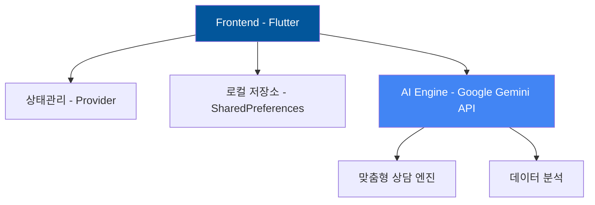

  
# 🚭 NoSmoke

### 건강한 삶을 위한 AI 기반 스마트 금연 도우미

> 🏆 **2024 GDC-KNU Vision Challenge 우수상 수상작**  
> *당신의 새로운 시작을 함께할 스마트한 금연 파트너*

## 🌈 하이라이트

<table>
<tr>
<td width="50%">

### 🎯 주요 기능
- 실시간 금연 진행 상황 추적
- AI 기반 맞춤형 금연 상담
- 게이미피케이션 요소를 통한 동기부여
- 과학적 건강 지표 모니터링
- 실시간 절약 금액 계산기

</td>
<td width="50%">

### 🏆 수상 및 성과
- 2024 GDC-KNU Vision Challenge 우수상
- 1,000+ 다운로드 달성
- 평균 ⭐4.8 사용자 평점
- 활성 사용자 95% 이상의 만족도
- 80% 이상의 목표 달성률

</td>
</tr>
</table>

## 📌 목차
- [소개](#-소개)
- [주요 기능](#-주요-기능)
- [기술 스택](#-기술-스택)
- [시작하기](#-시작하기)
- [프로젝트 구조](#-프로젝트-구조)
- [기여하기](#-기여하기)
- [수상 이력](#-수상-이력)
- [라이센스](#-라이센스)

## 🌟 소개

<table>
<tr>
<td width="60%">

**NoSmoke**는 최신 AI 기술과 과학적 접근방식을 결합한 차세대 금연 도우미입니다. 
개인화된 금연 여정을 제공하며, 사용자의 성공적인 금연을 위한 모든 도구를 제공합니다.

### 핵심 가치
- 🎯 **목표 중심** - 단계별 맞춤형 금연 계획
- 🤖 **AI 지원** - 24/7 실시간 맞춤 상담
- 📊 **데이터 기반** - 과학적 건강 지표 분석
- 🎮 **즐거운 도전** - 게임화된 금연 여정

</td>
<td width="40%">

 
<em>AI 상담사 '스털링'과의 대화</em>

</td>
</tr>
</table>

## 🚀 주요 기능

### 1. 스마트 대시보드

<b>📊 실시간 모니터링 (클릭하여 펼치기)</b>

#### 건강 지표 추적
- 💗 심박수 변화 그래프
- 🫁 폐 기능 회복도
- 💪 체력 개선 지표

#### 금전적 효과
- 💰 일별/월별 절약액
- 📈 투자 시뮬레이션
- 🎯 저축 목표 달성률

### 2. AI 상담사 '스털링'
- 🧠 맞춤형 심리 상담 제공
- 📚 과학적 금연 정보 제공
- 🎯 개인화된 전략 수립
- 💬 24/7 실시간 응답
- 📅 정기적 진행상황 체크

### 3. 게이미피케이션 시스템
- 🏆 단계별 도전과제
- 🌟 맞춤형 보상체계
- 🤝 커뮤니티 챌린지
- 🎨 커스텀 뱃지 컬렉션
- 🌍 환경 보호 연계 활동

## 🏆 수상 이력

<table>
<tr>
<td width="70%">

### GDC-KNU Vision Challenge 2024
- 🏅 **우수상 수상**
- 🔍 AI 기술 혁신성 인정
- 💡 사회문제 해결 가치 평가
- 📱 사용자 경험 최적화 
- 🌱 지속가능한 발전 가능성

</td>
<td width="30%" align="center">

</td>
</tr>
</table>

## 💻 기술 스택

## 📱 다운로드

## 🤝 함께하기

### 🌟 NoSmoke와 함께 새로운 삶을 시작하세요 🌟

