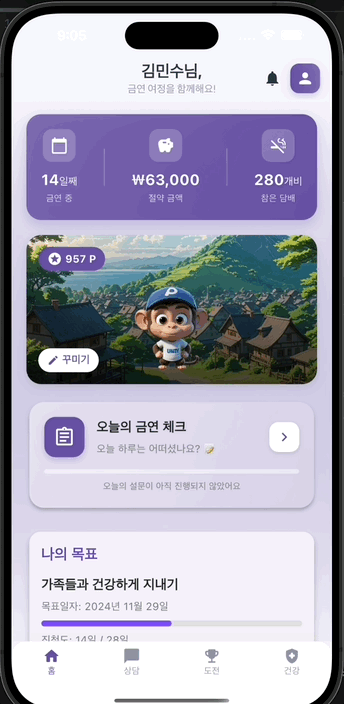
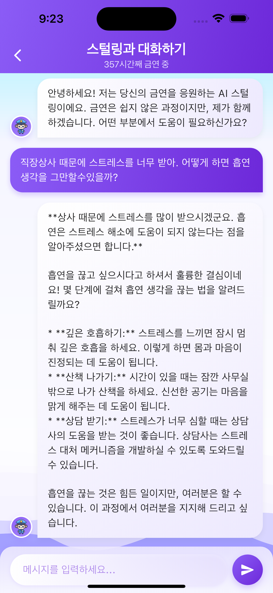
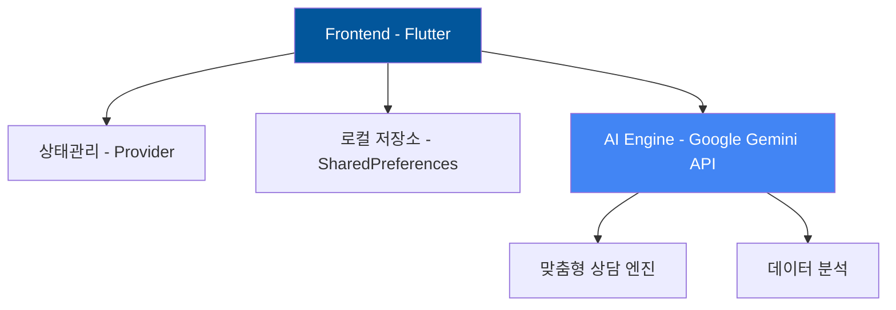

<div align="center">
  
# 🚭 NoSmoke

<p align="center">
  
  <br>
  <em>당신의 새로운 시작을 함께할 스마트한 금연 파트너</em>
</p>

### AI 기반 스마트 금연 도우미

[](https://flutter.dev)
[](https://deepmind.google/technologies/gemini/)
[](https://pub.dev/packages/provider)
[](https://github.com/Mseunghwan/no_smoke/stargazers)
[](https://opensource.org/licenses/MIT)

> 🏆 **2024 GDC-KNU Vision Challenge 우수상 수상작**

</div>

## 👥 주요 기여자

<table>
<tr>
<td align="center" width="50%">

<br/>
<strong>Mseunghwan</strong>
<br/>
<sub>Project Lead & Backend Developer</sub>
<br/>
• Flutter 앱 아키텍처 설계<br/>
• Gemini AI 통합 구현<br/>
• 데이터베이스 설계 및 구현<br/>
• CI/CD 파이프라인 구축
</td>
<td align="center" width="50%">

<br/>
<strong>mankaii</strong>
<br/>
<sub>Frontend Developer & UI/UX Designer</sub>
<br/>
• UI/UX 디자인 및 구현<br/>
• 사용자 인터페이스 최적화<br/>
• 애니메이션 및 인터랙션 개발<br/>
• 프론트엔드 성능 최적화
</td>
</tr>
</table>

## 📌 목차
- [소개](#-소개)
- [주요 기능](#-주요-기능)
- [기술 스택](#-기술-스택)
- [시작하기](#-시작하기)
- [프로젝트 구조](#-프로젝트-구조)
- [기여하기](#-기여하기)
- [라이센스](#-라이센스)

## 🌟 소개
**NoSmoke**는 과학적 접근방식과 AI 기술을 결합하여 사용자의 성공적인 금연을 지원하는 스마트 도우미입니다.
단순한 금연 앱을 넘어, 개인화된 여정을 제공하는 디지털 웰니스 플랫폼입니다.

<div align="center">
  
  <br>
  <em>AI 상담사 '스털링'과의 대화 인터페이스</em>
</div>

### 💫 핵심 가치
- 🎯 **목표 중심** - 명확한 목표 설정과 달성 가능한 단계별 접근
- 🤖 **AI 파워** - Gemini API 기반 24/7 맞춤형 상담
- 📊 **데이터 중심** - 실시간 건강 지표 모니터링
- 🎮 **엔터테인먼트** - 게이미피케이션을 통한 지속적 동기부여

## 🚀 주요 기능

### 1. 스마트 대시보드
<details>
<summary><b>📊 실시간 모니터링 시스템</b></summary>
<br/>

#### ⏱️ 실시간 금연 타이머
- 금연 시작 시점부터의 정확한 시간 추적
- 주요 건강 개선 마일스톤 알림
- 실시간 진행 상황 시각화

#### 💰 금전적 효과 계산기
- 일일/월간/연간 절약 금액 시각화
- 맞춤형 저축 목표 설정
- 투자 수익 시뮬레이션

#### 📈 건강 개선 트래커
- 심박수, 산소포화도 등 주요 건강 지표 모니터링
- 과학적 근거 기반 건강 개선 타임라인
- 개인별 건강 리포트 생성
</details>

### 2. AI 상담사 '스털링'
<div align="center">
  <table>
    <tr>
      <td align="center" width="33%">
        <h4>🧠 맞춤형 심리 상담</h4>
        • 개인별 금연 패턴 분석<br/>
        • 실시간 스트레스 관리<br/>
        • 맞춤형 동기부여
      </td>
      <td align="center" width="33%">
        <h4>📚 과학적 정보 제공</h4>
        • 최신 금연 연구 자료<br/>
        • 건강 개선 정보<br/>
        • 성공 사례 분석
      </td>
      <td align="center" width="33%">
        <h4>📊 진행상황 분석</h4>
        • 실시간 성과 측정<br/>
        • 위험 요소 예측<br/>
        • 맞춤형 대응 전략
      </td>
    </tr>
  </table>
</div>

### 3. 도전과제 시스템
#### 🎯 단계별 미션
- **일일 챌린지**
  - 아침 루틴 형성
  - 스트레스 관리 활동
  - 건강한 대체 활동 수행
- **주간 목표**
  - 운동 습관 형성
  - 식단 개선
  - 금연 구역 확장
- **월간 대형 과제**
  - 장기 목표 달성
  - 커뮤니티 활동 참여
  - 멘토링 프로그램

#### 🌍 소셜 임팩트
- 환경 보호 연계 활동
- 커뮤니티 참여형 챌린지
- 금연 캠페인 참여

#### 🏆 보상 시스템
- 커스텀 뱃지 컬렉션
- 실제 혜택과 연계된 포인트
- 단계별 업적 달성 리워드

## 🏆 수상 이력
<div align="center">
<table>
<tr>
<td align="center">
<h3>2024 GDC-KNU Vision Challenge 우수상</h3>

- 🌟 **혁신적인 AI 기술 활용**
- 🎯 **사회문제 해결 기여도**
- 💡 **기술 구현의 완성도**
- 👥 **사용자 경험 최적화**
- 🌱 **프로젝트 확장 가능성**

</td>
</tr>
</table>
</div>

## 💻 기술 스택


## 🚀 시작하기
### 전제 조건
- Flutter SDK 3.0 이상
- Dart SDK 2.17 이상
- Android Studio / VS Code
- Google Gemini API 키

### 설치 방법
```bash
# 1. 저장소 클론
git clone https://github.com/Mseunghwan/no_smoke.git

# 2. 프로젝트 디렉토리로 이동
cd no_smoke

# 3. 의존성 설치  
flutter pub get

# 4. 환경 변수 설정
cp .env.example .env
# .env 파일에 API 키 추가

# 5. 실행
flutter run
```

## 📁 프로젝트 구조
```
lib/
├── main.dart
├── models/
│   ├── challenge/
│   ├── chat_message/
│   ├── daily_survey/
│   ├── health_status/
│   ├── profile_item/
│   └── user_settings/
├── provider/
│   ├── profile_provider/
├── screens/
│   ├── challenge_screen/
│   ├── chat_screen/
│   ├── daily_survey_screen/
│   ├── health_status_screen/
│   ├── home_screen/
│   ├── onboarding_screen/
│   └── profile_screen/
├── services/
│   ├── gemini_service/  
│   └── notification_service/
├── widgets/
│   ├── achievement_card/
│   ├── daily_survey_card/
│   ├── goal_card/
│   ├── profile_preview/
└   └── stats_card/
```

## 📱 다운로드

<div align="center">

[](https://play.google.com/store)
[](https://apps.apple.com)

<table>
<tr>
<td align="center">

<br/>
<em>실제 앱 구동 화면</em>
</td>
</tr>
</table>

</div>

## 🤝 함께하기

<div align="center">

[](https://github.com/Mseunghwan/no_smoke/issues)
[](https://github.com/Mseunghwan/no_smoke/issues)
[](https://github.com/Mseunghwan/no_smoke/pulls)

### 🌟 NoSmoke와 함께 새로운 삶을 시작하세요 🌟

</div>
